# Maria's Favourite Recipes! - Milestone Project 3

A site that allows users to add their own recipes to be viewed publicly!

To view the live version of the site, please click [here](https://ms3-maria-recipe-site.herokuapp.com/)

---

## UX Design

### User Stories

*First Time Users*

- As a first time user, I would like to be able to easily navigate to the recipes.
  - I have achieved this by having a button on index.html that will take the user to the recipes page. There is also a clear description of where the button will take the user.
- As a first time user, I would like to easily see whats the story behind the page.
  - I have achieved this by having a small background story about Maria and her healthy eating journey on index.html.
- As a first time user, I would like to be told how I can add my own recipes.
  - I have achieved this by indicating on the index.html that the user is able to add recipes to the page by registering a profile, once the user has registered their profile then they're redirected to my_recipes.html where they will see the 'Add New Recipe' button.

*Returning Users*

- As a returning user, I would like to see all of my own recipes seperate from other users.
  - I have achieved this by creating the 'my_profile.html' page. This page consists of all of the recipes that are created by the session user. 

*Admin Users*

- As an Admin User, I want total control of all recipes on the page (To edit and delete recipes added by other users).
  - I have achieved this by creating a profile under 'Maria'. On recipes.html, Maria is able to click a button 'Recipe Editor' and then will be able to edit or delete any recipe within the database. Other users have this functionality but its restricted to their own profile page. 

### Wireframes

- Home Page
  - Desktop

  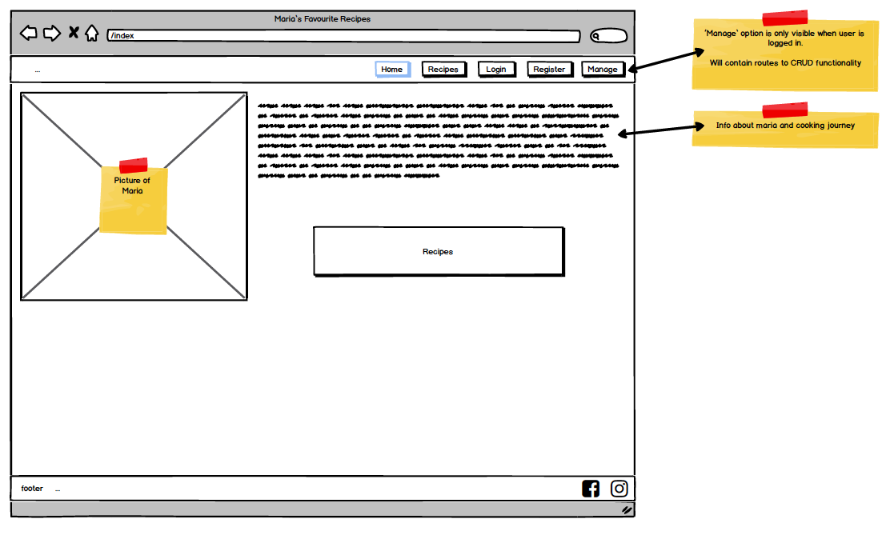

  - Tablet

  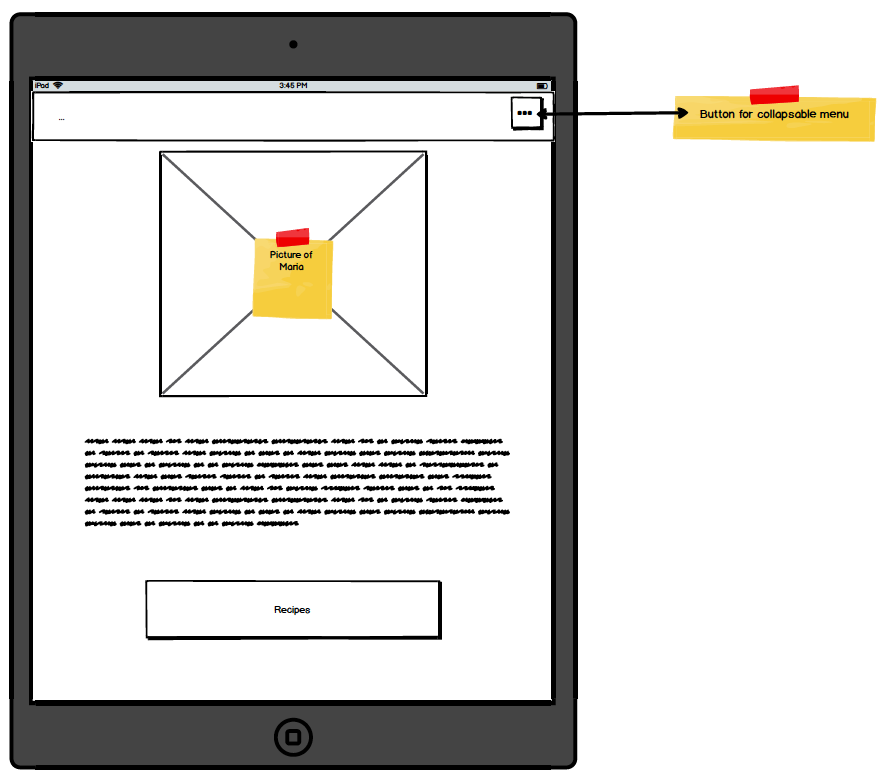

  - Tablet - nav

  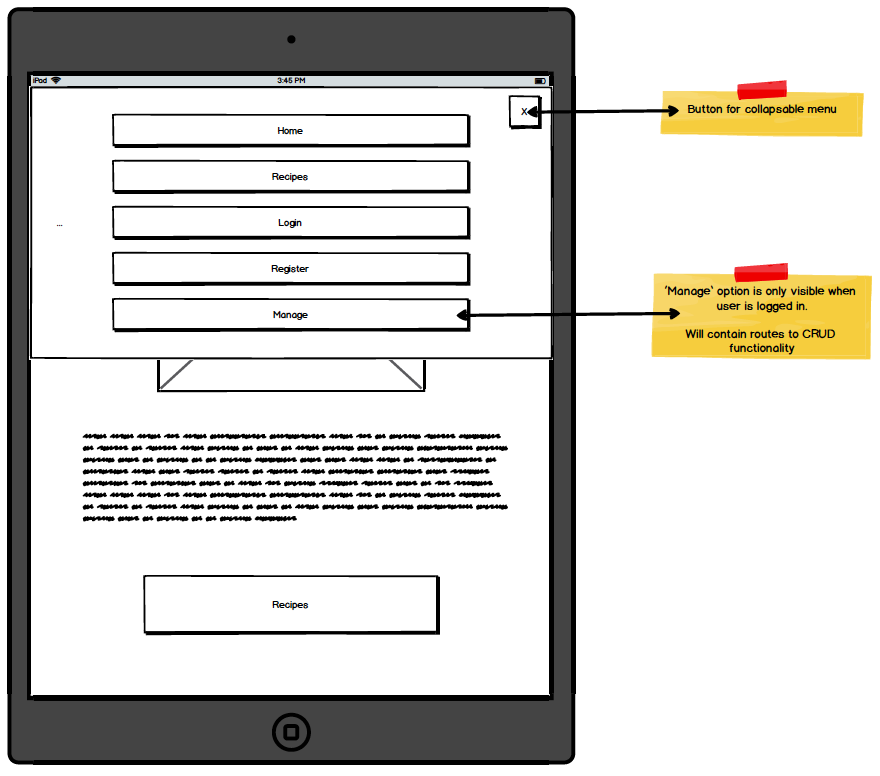

  - Mobile

  

  - Mobile - nav

  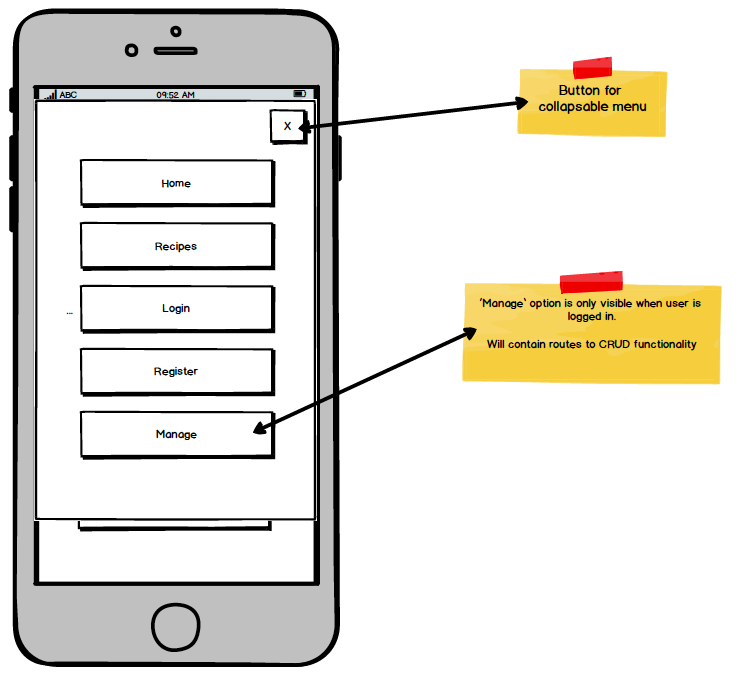

- Recipes
  - Desktop

  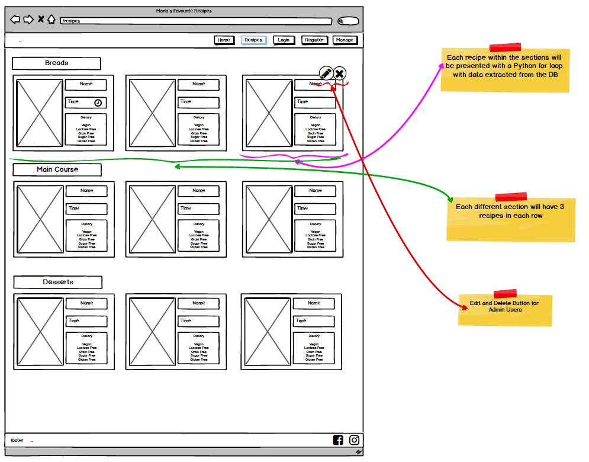
  - Tablet

  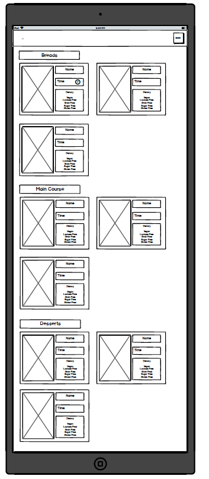
  - Mobile

  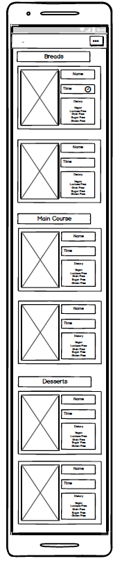

- Login
  - Desktop

  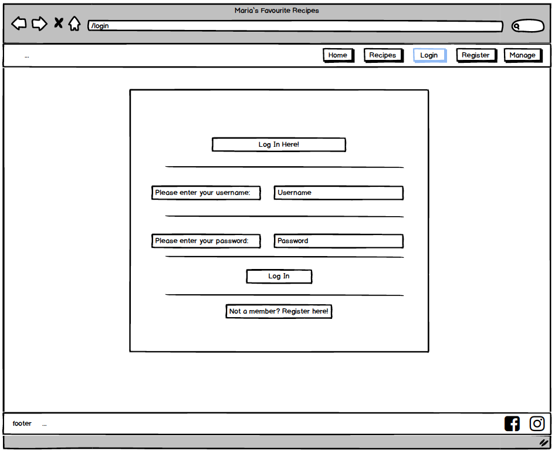
  - Tablet 
  
  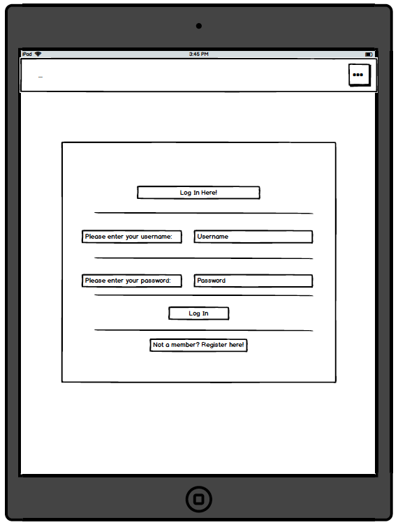
  - Mobile

  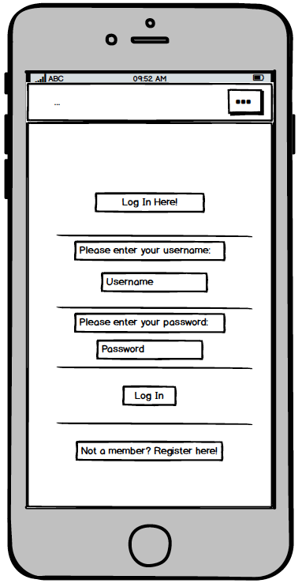

- Register 
  - Desktop 

  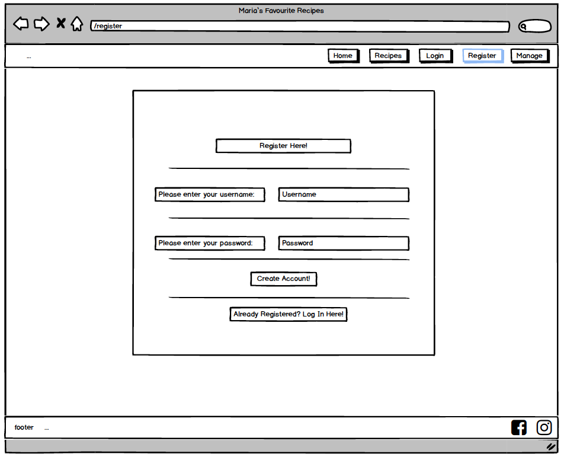
  - Tablet 

  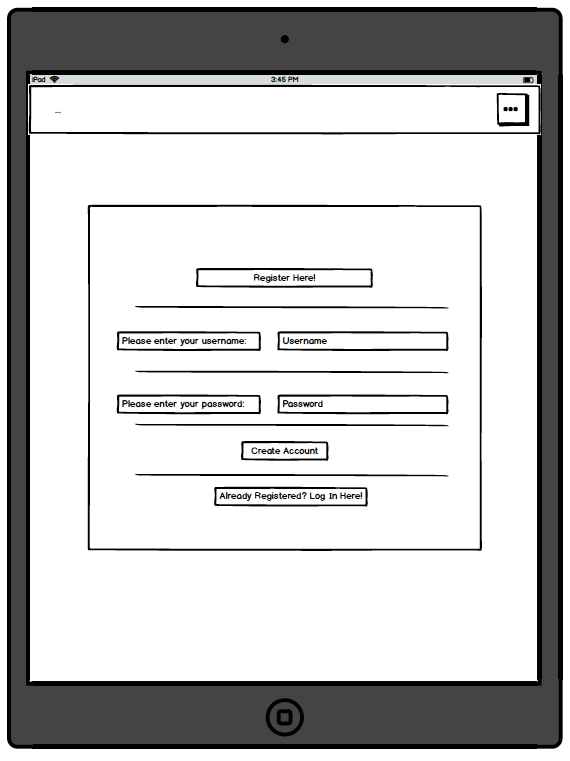
  - Mobile 

  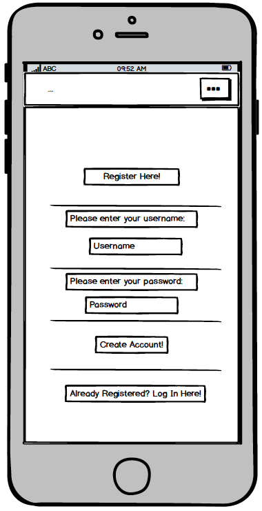

- Add Recipe Form 

  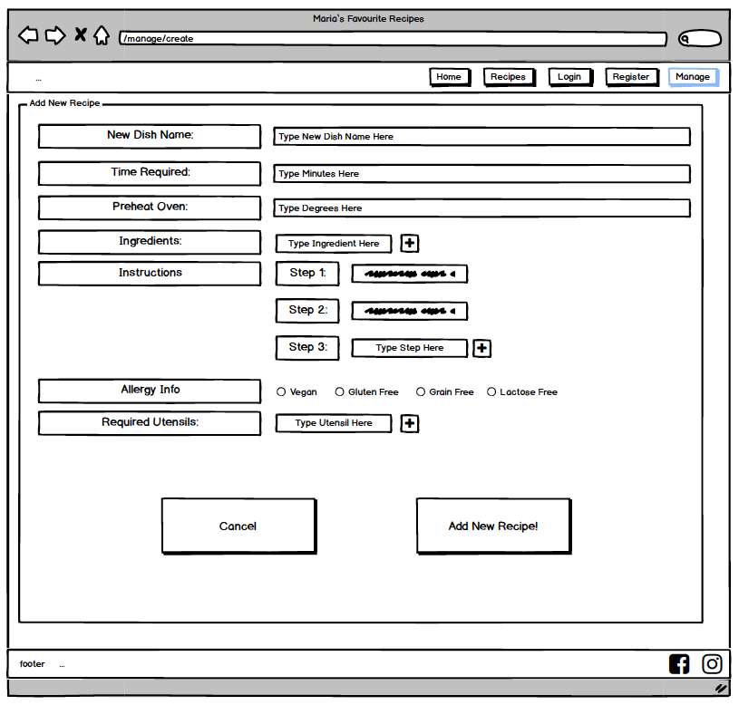

---

# Features

- Recipes

  - Unregistered users are able to view all recipes that have been uploaded by registered users. This is achieved by a button on the home page that once clicked, will take them to 'recipes.html'.

  - Recipes are presented in rows of 3 on large devices, rows of 2 on tablets, and rows of 1 on mobile and are displayed to the user with an image, the name of, cooking time, servings info, a short description and a link to the full recipe.

  - Admin Users (Maria), will be able to delete or edit the data of recipes entered by all users, whereas everyone else will only be able to edit or delete their own.

- Register/Login 
  
  - A user will need to register a profile to be able to add any recipes, this infomation is on index.html.

  - If a user tries to register a username which is used by someone else already, they will not be allowed to use that username. The user will be notified of this by use of Flash Messages - "Username already exists!".

  - When a user has successfully registered their new profile, they will be redirected to 'my_recipes.html'.

  - When a returning user logs in successfully, they will also be redirected to 'my_recipes.html'.

  - If a user puts their infomation in incorrectly, they will be notified by the use of Flash Messages - "Incorrect Username and/or Password".

- Full Recipes

  - When users are viewing the basic recipe view on recipes.html, they are offered to take a look at the 'Full Recipe'. Once clicked, the users are presented with all of the data related to their chosen recipe, which is kept on MongoDB.

  - Once users are finished with the page, they will be able to go back by clicking the Back button at the foot of the recipe.

- My Recipes 

  - Upon registering/loggin in, the user will be greeted with the profile page(my_recipes.html)

  - Users here will be shown two buttons - 'Recipe Editor' and 'Add New Recipe' (See more details of these below).

  - The 'Add New Recipe' button will redirect the users to the form template that the users will need to fill out to add their recipes. 

  - Once the user has added a recipe, they will see it on their profile page. 

- Add Recipe
  
  - When users are adding a new recipe to their profile, they are guided through with notifications of what to do and requirements. 

  - The form will not be able to be submitted with any boxes not filled out by the user as to prevent any errors with the full recipe data, the user will be notified as the required attribute has been added.

- Recipe Editor

  - If users ever decide that they would like to edit any of the data or delete the entire recipe, all they need do is click on the Recipe Editor Button! This button will reveal two buttons underneath all of their inputted recipes. 

  - The green button has a notepad and pen icon, I decided on this image as it clearly is an indicator to some editing functionality.

  - The red button has a cross in circle icon, as above, I have used this icon and color as it is a clear indicator to deleting the recipe.

  - When the user tries to delete a recipe, they will be asked to confirm if that is what they want to do by means of a confirmation message. This is to prevent any user to delete a recipe by mistake. 

# Features Left to Impliment

1 - The 'Recipe Editor' and 'Add New Recipe' buttons are hidden by sidebar button or muteable someway should the user wish to only see their own recipes.

2 - More in depth registration form asking user for more credentials such as first and last name which could later be used visually.

3 - When adding a new recipe, having a checkbox form for 'Dietary Information' with values such as Vegan, Keto, Gluten Free ect. and 'Other: ...' text area.

--- 

# Technologies Used 

- [HTML5](https://en.wikipedia.org/wiki/HTML)
  - To give the page its structure and presenting static data.
  - All HTML files are located within the 'templates' directory.

- [CSS](https://en.wikipedia.org/wiki/CSS)
  - CSS has been used to style and customise the content of this project.

- [Materialize](https://materializecss.com/)
  - This is a framework that I have used to simplify CSS classes, features that have been used and modified include the navbar, responsive design classes, and colors for backgrounds and text.
  

- [JQuery](https://en.wikipedia.org/wiki/JQuery)
  - JQuery has been used to give the site its functionality as well as making DOM manipulation simpler.
  - Pages that include functionality are:
    - recipes.html for Admin users only
    - my_recipes.html for all users
    - add_recipe.html for all users

- [MongoDB](https://en.wikipedia.org/wiki/MongoDB) 
  - As the data entered by users can always be different from one to the next, the project uses MongoDB to store its data as MongoDB is a Document Based Database.

- [Flask](https://en.wikipedia.org/wiki/Flask_(web_framework))
  - Flask is a framework that allows developers to easily present data in an orderly fashion. All data entered by a user, such as the Recipe Name, is presented to users with a few lines of code embedded into the HTML.
  - Modules from Flask that have been included are:
    - Flask
    - flash
    - render_template
    - redirect
    - request
    - session
    - url_for
    - jsonify

- [Python](https://en.wikipedia.org/wiki/Python_(programming_language))
  - Python is working very closely with Flask to manipulate data and HTML across multiple pages within the app.

- [Heroku](https://en.wikipedia.org/wiki/Heroku)
  - Heroku has been used to deploy and host the app as it meets the need of being able to handle python.

- [Google Fonts](https://fonts.google.com/specimen/Abel?query=Abel)
  - The font I have used for this project is called Abel.